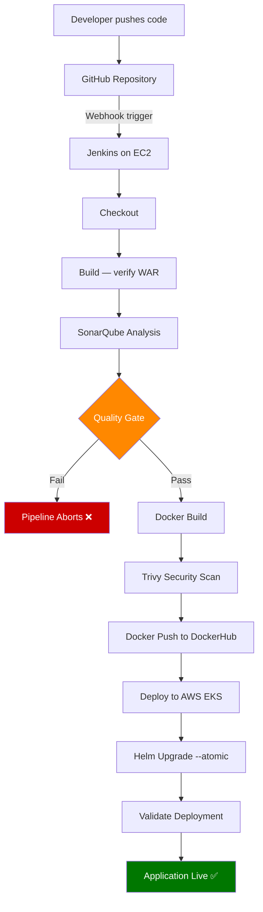
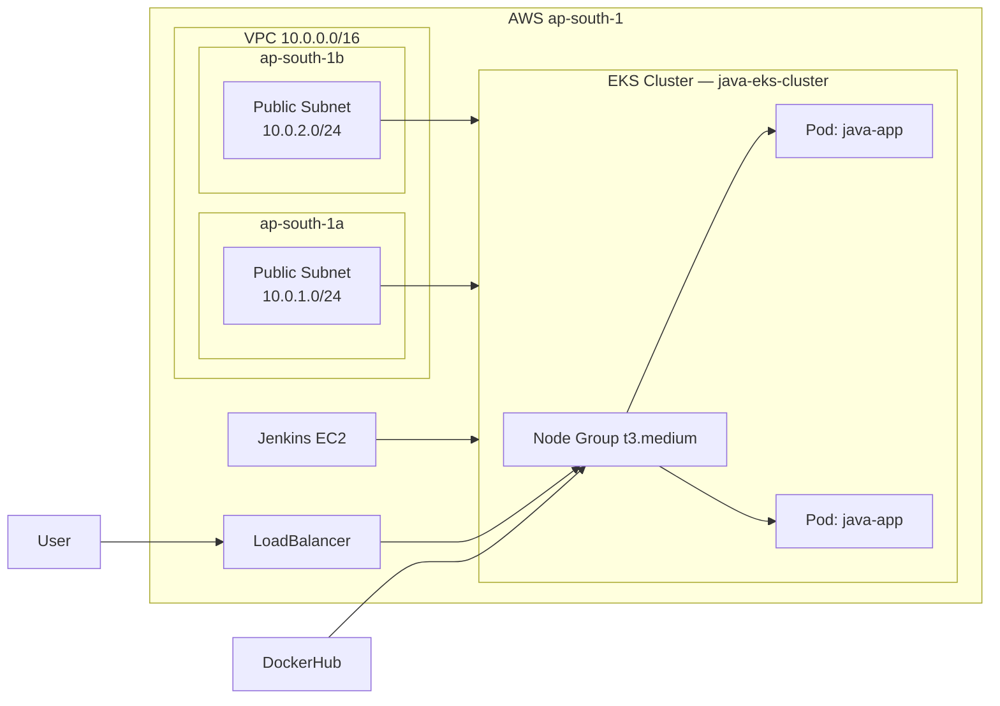
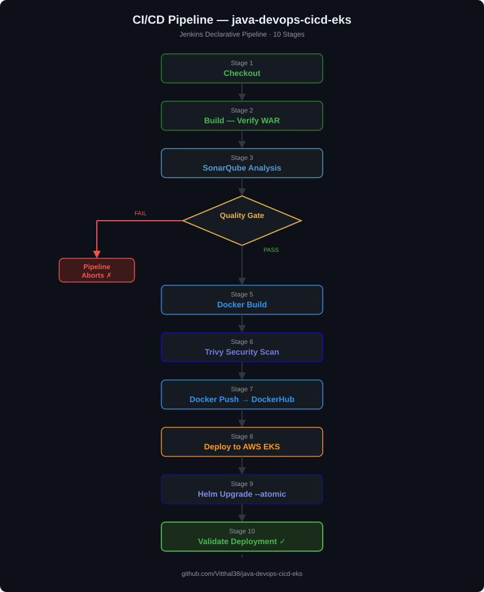
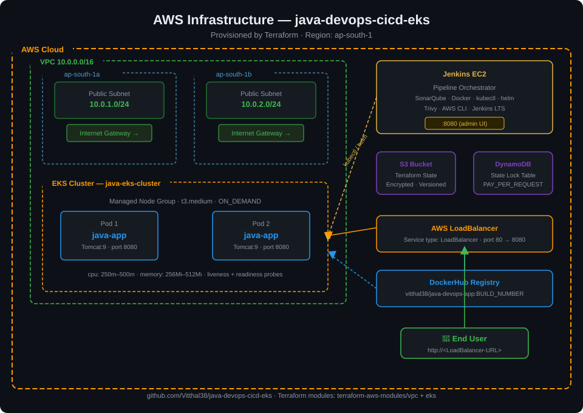

# Java DevOps CI/CD — EKS Pipeline

[](#)
[](#)
[](#)
[](#)
[](#)
[](#)
[](#)
[](#)

End-to-end DevOps pipeline for a Java WAR application — from a GitHub push to a running container on AWS EKS — with code quality gates, image security scanning, zero-downtime rolling deployments, and Helm-managed releases.

---

## Table of Contents

- [Architecture](#architecture)
- [CI/CD Pipeline](#cicd-pipeline)
- [Technology Stack](#technology-stack)
- [Repository Structure](#repository-structure)
- [Prerequisites](#prerequisites)
- [Setup Guide](#setup-guide)
- [Screenshots](#screenshots)
- [Troubleshooting](#troubleshooting)
- [Learning Outcomes](#learning-outcomes)

---

## Architecture



## AWS Infrastructure



---

## CI/CD Pipeline

| # | Stage | What Happens | On Failure |
|---|---|---|---|
| 1 | Checkout | Clones repo at the triggered commit | Abort |
| 2 | Build | Verifies WAR artifact exists | Abort |
| 3 | SonarQube Analysis | Static analysis — bugs, vulnerabilities, code smells | Abort |
| 4 | Quality Gate | Enforces minimum quality threshold via `waitForQualityGate` | **Abort** |
| 5 | Docker Build | Builds and tags image with `BUILD_NUMBER` and `latest` | Abort |
| 6 | Trivy Scan | Scans image for HIGH/CRITICAL CVEs — results visible in logs | Report only |
| 7 | Docker Push | Pushes both tags to DockerHub | Abort |
| 8 | Deploy to EKS | Rolling update — zero downtime | Abort |
| 9 | Helm Upgrade | `--atomic` flag auto-rolls back on failure | Auto-rollback |
| 10 | Validate | Confirms rollout complete, pods Running, service up | Abort |

---

## Technology Stack

| Category | Tool | Purpose |
|---|---|---|
| CI/CD | Jenkins | Pipeline orchestration |
| IaC | Terraform | AWS VPC + EKS provisioning |
| Container | Docker | Image build, tag, push |
| Security | Trivy | Container vulnerability scanning |
| Code Quality | SonarQube | Static analysis + mandatory quality gate |
| Orchestration | Kubernetes | Pod scheduling, rolling updates, health checks |
| Package Manager | Helm | Release management with atomic rollback |
| Cloud | AWS EKS | Managed Kubernetes cluster |
| Registry | DockerHub | Container image storage |
| App Server | Tomcat 9 (JDK 17) | Java WAR runtime |

---

## Repository Structure

```
java-devops-cicd-eks/
├── .gitignore                        # Excludes tfstate, .terraform/, .git/, etc.
├── Dockerfile                        # Non-root Tomcat 9 — pinned base image + HEALTHCHECK
├── Jenkinsfile                       # 10-stage declarative pipeline
├── pom.xml                           # Maven project descriptor
├── app/
│   └── ROOT.war                      # Compiled Java WAR artifact
├── src/main/webapp/                  # JSP source files
├── terraform/
│   ├── backend.tf                    # S3 remote state + DynamoDB lock
│   ├── main.tf                       # VPC + EKS using community modules
│   ├── variables.tf                  # All variables with types, descriptions, validation
│   ├── outputs.tf                    # Cluster endpoint, kubectl config command
│   └── terraform.tfvars.example      # Template — copy to terraform.tfvars
├── k8s/
│   ├── namespace.yaml                # Dedicated namespace
│   ├── deployment.yaml               # Probes, resource limits, security context, rolling update
│   ├── service.yaml                  # LoadBalancer service
│   └── ingress.yaml                  # ALB ingress (AWS Load Balancer Controller)
└── helm/java-app-chart/
    ├── Chart.yaml                    # Chart metadata
    ├── values.yaml                   # All configurable values — corrected image reference
    └── templates/
        ├── _helpers.tpl              # Reusable label and name functions
        ├── deployment.yaml           # Templated deployment — fully parameterized
        ├── service.yaml              # Templated service
        └── NOTES.txt                 # Post-install instructions printed by helm install
```

---

## Prerequisites

| Tool | Version | Purpose |
|---|---|---|
| AWS CLI | >= 2.x | AWS authentication and EKS config |
| Terraform | >= 1.5 | Infrastructure provisioning |
| kubectl | 1.29.x | Cluster management |
| Helm | >= 3.x | Chart deployment |
| Docker | >= 24.x | Local image build and test |

---

## Setup Guide

### 1 — Provision AWS Infrastructure

```bash
# Create the S3 bucket for Terraform state (one-time — do this first)
aws s3 mb s3://vitthal-terraform-state-java-eks --region ap-south-1
aws s3api put-bucket-versioning \
  --bucket vitthal-terraform-state-java-eks \
  --versioning-configuration Status=Enabled

cd terraform/
cp terraform.tfvars.example terraform.tfvars

terraform init      # downloads providers and modules, configures S3 backend
terraform plan      # review what will be created
terraform apply     # creates VPC + EKS (~15 minutes)

# Configure kubectl to point to the new cluster
$(terraform output -raw configure_kubectl)
kubectl get nodes
```

### 2 — Install Jenkins on EC2

```bash
sudo yum install -y java-17-amazon-corretto docker
sudo wget -O /etc/yum.repos.d/jenkins.repo \
  https://pkg.jenkins.io/redhat-stable/jenkins.repo
sudo rpm --import https://pkg.jenkins.io/redhat-stable/jenkins.io-2023.key
sudo yum install -y jenkins
sudo systemctl start jenkins docker
sudo systemctl enable jenkins docker
sudo usermod -aG docker jenkins
```

**Required Jenkins plugins:** Pipeline, Docker Pipeline, SonarQube Scanner, AWS Credentials

### 3 — Add Jenkins Credentials

| ID | Type | Value |
|---|---|---|
| `dockerhub-creds` | Username with Password | DockerHub login |
| `aws-creds` | AWS Credentials | IAM access key + secret |
| `sonarqube-token` | Secret Text | SonarQube user token |

Also configure: **Manage Jenkins → System → SonarQube servers** — name `SonarQube`, add server URL.

### 4 — Create the Pipeline

New Item → Pipeline → Pipeline script from SCM → Git → this repo URL → Branch: `*/main` → Script Path: `Jenkinsfile` → Save → Build Now

### 5 — Verify the Deployment

```bash
kubectl get pods -n java-app -o wide
kubectl get svc -n java-app
helm status java-app -n java-app

# Open the EXTERNAL-IP from the LoadBalancer service in a browser
```

### 6 — Destroy When Done (avoid AWS costs)

```bash
cd terraform/
terraform destroy
```

---

## Architecture Diagrams

### CI/CD Pipeline



### AWS Infrastructure



---

## Screenshots

> *Capture these after running the pipeline and add to `docs/screenshots/` — they are the highest-value portfolio evidence.*

| # | Screenshot | What It Proves |
|---|---|---|
| 1 | Jenkins pipeline — all 10 stages green | Pipeline runs end-to-end |
| 2 | Trivy scan output in Jenkins console log | Security scanning is active |
| 3 | SonarQube dashboard — quality gate PASSED | Code quality enforcement works |
| 4 | DockerHub — multiple versioned tags (1, 2, 3...) | Pipeline ran repeatedly; image tagging works |
| 5 | `kubectl get pods -n java-app` — 2/2 Running | EKS deployment succeeded |
| 6 | `helm status java-app` — STATUS: deployed | Helm release is healthy |
| 7 | `terraform apply` terminal output | Real infrastructure was provisioned |
| 8 | Application in browser at LoadBalancer URL | End-to-end: the thing actually works |

---

## Troubleshooting

| Problem | Cause | Fix |
|---|---|---|
| `ImagePullBackOff` | Image name in manifest doesn't match pushed image | Verify `DOCKER_IMAGE` in Jenkinsfile matches `image.repository` in `values.yaml` |
| Pods stuck in `Pending` | Node has insufficient CPU/memory | `kubectl describe pod <name> -n java-app` — check Events |
| Quality Gate always times out | Jenkins can't reach SonarQube | Check SonarQube server URL in Jenkins System config |
| Helm upgrade fails, auto-rollback | Pods crashlooping on new image | `kubectl logs -l app=java-app -n java-app` |
| `kubectl` fails in pipeline | kubeconfig missing on Jenkins node | Ensure `aws eks update-kubeconfig` runs before every kubectl command |
| `Error acquiring state lock` | Previous apply crashed mid-run | `terraform force-unlock <LOCK_ID>` |
| Trivy: many CVEs on base image | Upstream Tomcat image has unpatched CVEs | Pin to a newer patch version in Dockerfile |

---

## Learning Outcomes

- Provisioning AWS infrastructure (VPC + EKS) with Terraform remote state and DynamoDB locking
- Writing Jenkins declarative pipelines with proper credential handling, timeouts, and cleanup
- Using SonarQube as a mandatory gate — `waitForQualityGate` makes it fail the build, not just report
- Building Docker images with non-root users, pinned base images, and Docker HEALTHCHECK
- Running Trivy image scans inside a Jenkins pipeline
- Zero-downtime Kubernetes rolling updates with `maxSurge` and `maxUnavailable` configured
- Liveness vs readiness probes — understanding the operational difference
- Helm `--atomic` flag for automatic rollback when a deployment fails

---

## Future Improvements

| Improvement | Why Not Now |
|---|---|
| ArgoCD GitOps | Adds a full GitOps layer — good next project, not needed here |
| Prometheus + Grafana | Valuable in production; out of scope for this CI/CD demonstration |
| GitHub Actions as secondary CI | Worth learning after this pipeline is stable |
| Multi-environment Helm values | Good next step — add `values-dev.yaml` and `values-prod.yaml` |

---

*Built by [Vitthal Misal](https://github.com/Vitthal38) — B.Tech CS 2025 | Cloud & DevOps*
